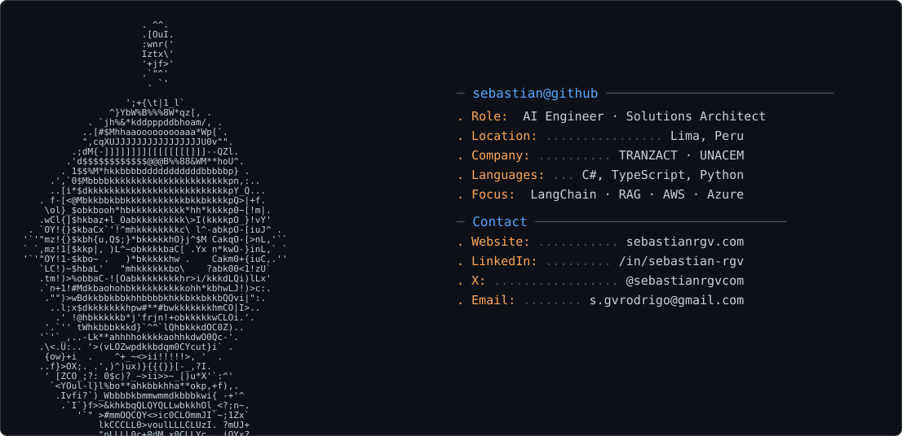

<picture>
  <source media="(prefers-color-scheme: dark)" srcset="dark_mode.svg" />
  <source media="(prefers-color-scheme: light)" srcset="light_mode.svg" />
  
</picture>

### Hello there!

I'm Sebastian, an AI engineer and solutions architect from Lima, Perú 🇵🇪

I build AI-powered platforms... and make sure they scale.

Through LangChain, cloud architecture, and clean engineering.

I've spent the last years deep in the technical side: production RAG pipelines, cost-optimized serverless platforms, and increasingly, AI agents and workflow automation.

These days, I'm focused on turning AI research into products people actually use — from generative AI copilots to intelligent automation that ships.

Currently building:

* [TZ Flows](https://github.com/sebastian-rgv) — CLI toolkit that turns repetitive engineering work into reusable YAML workflows (40% faster card setup)
* **RAG pipelines** at TRANZACT — production semantic search with LangChain + PostgreSQL pgvector
* **Serverless sales platform** at UNACEM — cost-optimized AWS architecture (+67% daily quotations)

Other things I've built:

* [LexRoute](https://github.com/sebastian-rgv) — legal intake PWA that routes structured briefs via WhatsApp (-60% triage time)
* **Adaptive Exam Coach** — RAG-powered exam prep with personalized quizzes
* **Pediatric Monitoring** — newborn data tracking for early anemia detection
* **Autism Screening Suite** — clinician platform for early behavioral risk markers

Stack I work with:

* **AI/ML**: LangChain, LangGraph, RAG, TensorFlow, AI Agents, Vector Databases
* **Cloud**: AWS (Solutions Architect), Azure, Docker, Terraform, CI/CD
* **Languages**: Python, C#, TypeScript
* **Web**: Next.js, React, .NET, FastAPI, NestJS

Currently learning:

* M.Sc. in Data Science & AI @ UTEC (2026–2028)
* MIT MISTI — AI & Data Science Immersion (2027)
* Cloud cost governance, LangChain evaluators, clean architecture playbooks

📫 Let's connect:

* 🌐 [sebastianrgv.com](https://sebastianrgv.com)
* 💼 [LinkedIn](https://www.linkedin.com/in/sebastian-rgv/)
* 🐦 [X / Twitter](https://x.com/sebastianrgvcom)
* 📧 s.gvrodrigo@gmail.com
